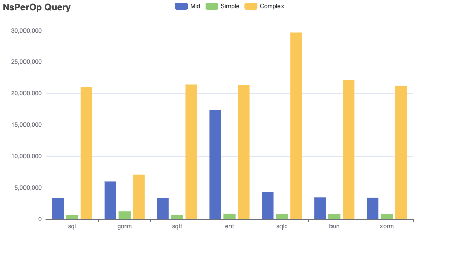
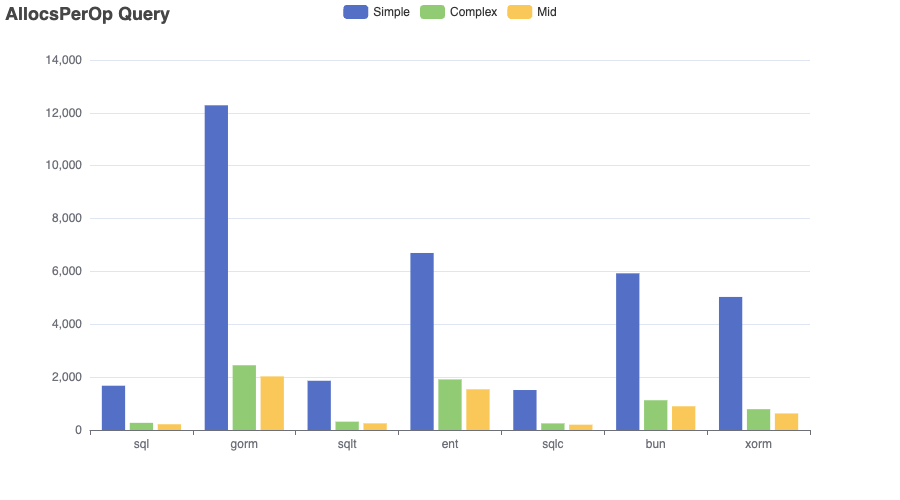
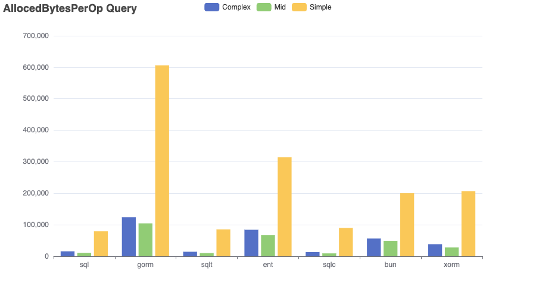
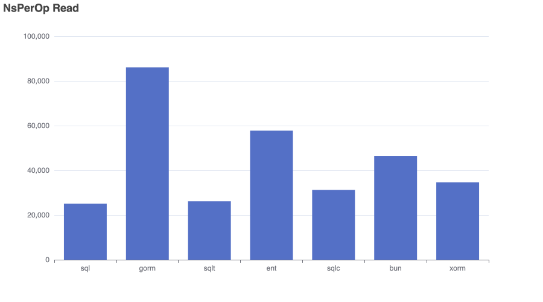
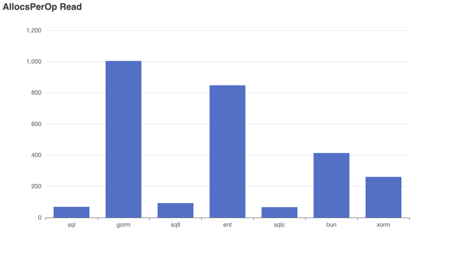
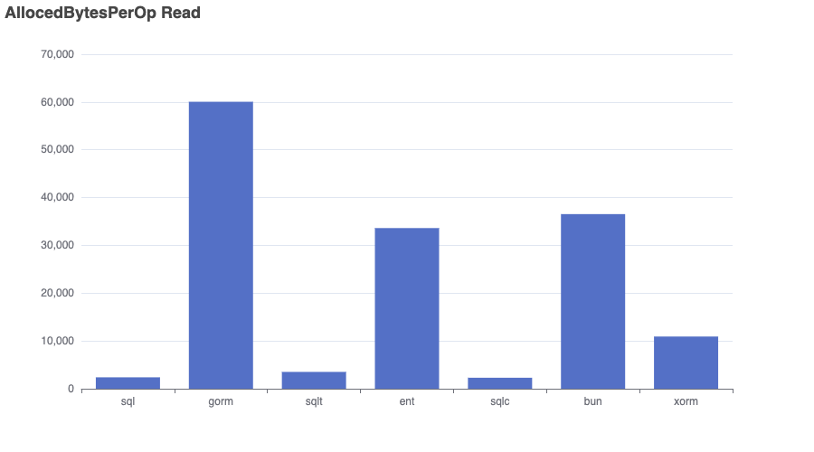
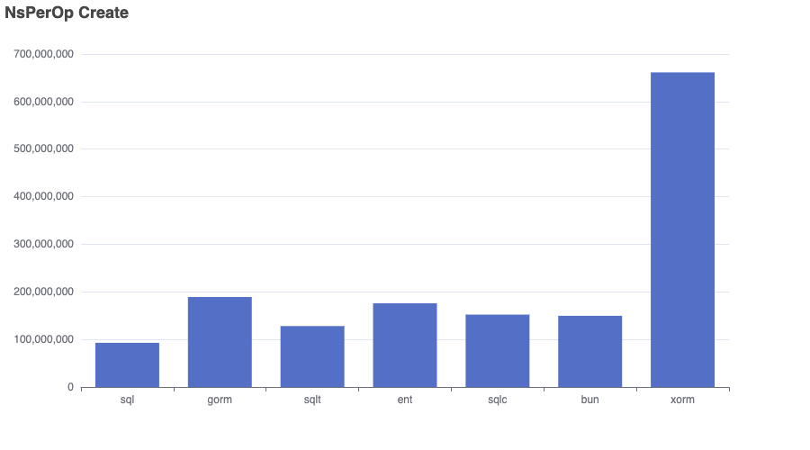
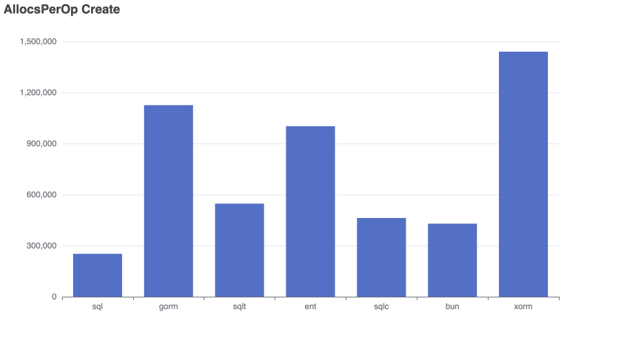
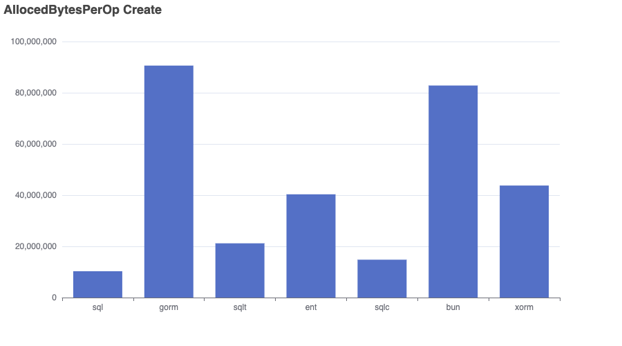

# Bench-Flix

This benchmark imports a dataset of Netflix movies into a SQLite database and runs a range of queries to compare performance, memory usage, and allocation efficiency across different go packages.

⚠️ Results aren’t always perfectly comparable — for example, both GORM and Bun use preloading to resolve many-to-many relationships. 

I’m open to feedback and suggestions — I’m not an expert in every tool and aim to make this benchmark as fair and informative as possible.

👉 Want to add another SQL library? Just open a pull request!

- Dataset: [kaggle/netflix-movies](https://www.kaggle.com/datasets/bhargavchirumamilla/netflix-movies-and-tv-shows-till-2025)
- Sqlite Driver: [mattn/go-sqlite3](https://github.com/mattn/go-sqlite3)
- sql: database/sql
- gorm: [gorm.io](https://gorm.io/)
- ent: [entgo.io](https://entgo.io/)
- sqlc: [sqlc.dev](https://sqlc.dev/)
- bun: [bun.uptrace.dev](https://bun.uptrace.dev/)
- xorm: [xorm.io](https://xorm.io/)
- sqlt: [wroge/sqlt](https://github.com/wroge/sqlt) (my own package)

## Benchmark

The “Complex” query in the ```gorm``` repository is significantly faster than in other implementations. This suggests that ```gorm```'s preloading strategy performs better for handling multiple many-to-many relationships compared to joining everything in a single query.
As expected, the implementation using standard SQL is the fastest overall.
```sqlt``` (my own library) is competitive with standard SQL, aiming for clean abstraction with minimal runtime overhead. 
```sqlc``` is efficient , but queries with multiple filters must be fully composed and executed within the database, limiting performance.

```bash
go test -bench . -run=xxx -benchmem
goos: darwin
goarch: arm64
pkg: github.com/wroge/bench-flix
cpu: Apple M3 Pro
BenchmarkCreate/sql-12                12          93232389 ns/op        10293666 B/op     252134 allocs/op
BenchmarkCreate/gorm-12                6         186885868 ns/op        90601056 B/op    1125525 allocs/op
BenchmarkCreate/sqlt-12                8         127060406 ns/op        21160845 B/op     550356 allocs/op
BenchmarkCreate/ent-12                 6         171110861 ns/op        40478478 B/op    1006100 allocs/op
BenchmarkCreate/sqlc-12                7         150476958 ns/op        14815469 B/op     462542 allocs/op
BenchmarkCreate/bun-12                 7         150511661 ns/op        82796046 B/op     428873 allocs/op
BenchmarkCreate/xorm-12                2         657087166 ns/op        43763876 B/op    1439634 allocs/op
BenchmarkQuery/Complex_sql-12         56          20558127 ns/op           15705 B/op        271 allocs/op
BenchmarkQuery/Complex_gorm-12       175           6910155 ns/op          124227 B/op       2450 allocs/op
BenchmarkQuery/Complex_sqlt-12        55          20671452 ns/op           14370 B/op        316 allocs/op
BenchmarkQuery/Complex_ent-12         56          20748983 ns/op           84134 B/op       1914 allocs/op
BenchmarkQuery/Complex_sqlc-12        38          30267252 ns/op           13219 B/op        250 allocs/op
BenchmarkQuery/Complex_bun-12         55          21297947 ns/op           56284 B/op       1126 allocs/op
BenchmarkQuery/Complex_xorm-12        56          21345606 ns/op           38056 B/op        788 allocs/op
BenchmarkQuery/Mid_sql-12            348           3438156 ns/op           10908 B/op        218 allocs/op
BenchmarkQuery/Mid_gorm-12           212           5658897 ns/op          104464 B/op       2029 allocs/op
BenchmarkQuery/Mid_sqlt-12           352           3372110 ns/op           10164 B/op        252 allocs/op
BenchmarkQuery/Mid_ent-12             67          17287856 ns/op           67641 B/op       1540 allocs/op
BenchmarkQuery/Mid_sqlc-12           273           4350279 ns/op            9216 B/op        201 allocs/op
BenchmarkQuery/Mid_bun-12            342           3465869 ns/op           49190 B/op        898 allocs/op
BenchmarkQuery/Mid_xorm-12           357           3410284 ns/op           27945 B/op        627 allocs/op
BenchmarkQuery/Simple_sql-12        1659            712206 ns/op           79372 B/op       1676 allocs/op
BenchmarkQuery/Simple_gorm-12        936           1276657 ns/op          606707 B/op      12286 allocs/op
BenchmarkQuery/Simple_sqlt-12       1717            701445 ns/op           85239 B/op       1863 allocs/op
BenchmarkQuery/Simple_ent-12        1317            896515 ns/op          314178 B/op       6698 allocs/op
BenchmarkQuery/Simple_sqlc-12       1371            875907 ns/op           89728 B/op       1513 allocs/op
BenchmarkQuery/Simple_bun-12        1362            877810 ns/op          200545 B/op       5928 allocs/op
BenchmarkQuery/Simple_xorm-12       1466            807577 ns/op          206438 B/op       5035 allocs/op
BenchmarkRead/sql-12               47665             25160 ns/op            2384 B/op         69 allocs/op
BenchmarkRead/gorm-12              14049             85337 ns/op           60056 B/op       1004 allocs/op
BenchmarkRead/sqlt-12              45693             26317 ns/op            3522 B/op         93 allocs/op
BenchmarkRead/ent-12               20786             57582 ns/op           33623 B/op        848 allocs/op
BenchmarkRead/sqlc-12              39006             30905 ns/op            2296 B/op         67 allocs/op
BenchmarkRead/bun-12               25789             46200 ns/op           36544 B/op        414 allocs/op
BenchmarkRead/xorm-12              34306             34823 ns/op           10923 B/op        261 allocs/op
PASS
ok      github.com/wroge/bench-flix     312.764s
```

## Charts

```bash
go test -bench . -run=xxx -benchmem > bench.out
cat bench.out | go run ./cmd/chart/main.go --unit=NsPerOp --benchmark=Query
cat bench.out | go run ./cmd/chart/main.go --unit=AllocedBytesPerOp --benchmark=Query
cat bench.out | go run ./cmd/chart/main.go --unit=AllocsPerOp --benchmark=Query

cat bench.out | go run ./cmd/chart/main.go --unit=NsPerOp --benchmark=Create
cat bench.out | go run ./cmd/chart/main.go --unit=AllocedBytesPerOp --benchmark=Create
cat bench.out | go run ./cmd/chart/main.go --unit=AllocsPerOp --benchmark=Create

cat bench.out | go run ./cmd/chart/main.go --unit=NsPerOp --benchmark=Read
cat bench.out | go run ./cmd/chart/main.go --unit=AllocedBytesPerOp --benchmark=Read
cat bench.out | go run ./cmd/chart/main.go --unit=AllocsPerOp --benchmark=Read
```

  
  
  

  
  
  

  
  
  
