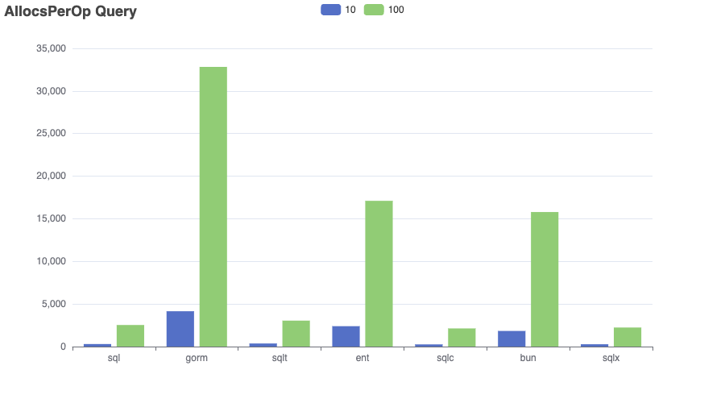
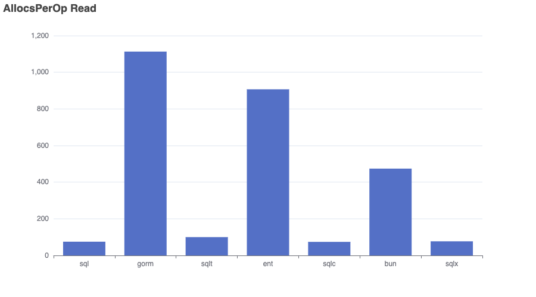
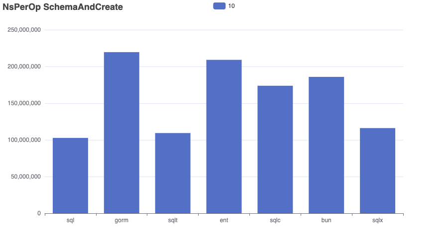
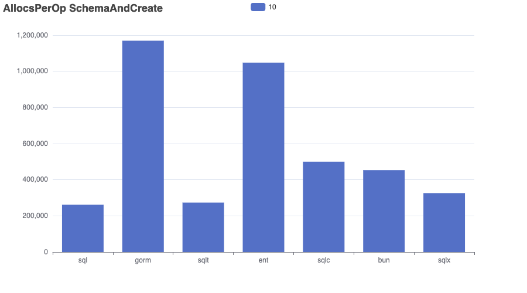
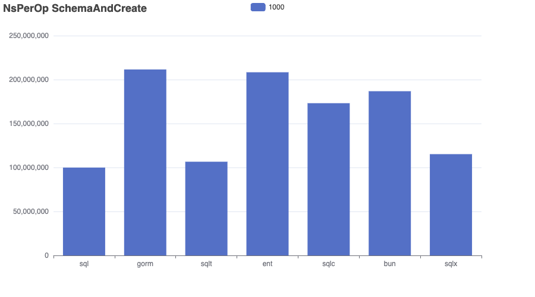
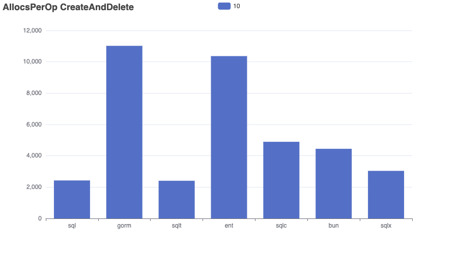
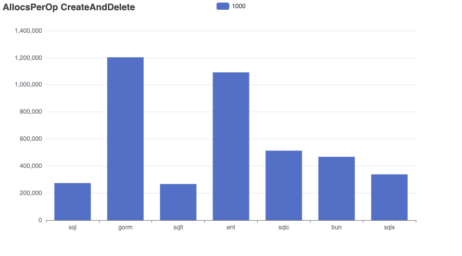

# Bench-Flix

This benchmark imports a dataset of Netflix movies into a SQLite database and runs a range of queries to compare performance, memory usage, and allocation efficiency across different go frameworks.

⚠️ Results aren’t always perfectly comparable — for example, both GORM and Bun use preloading to resolve many-to-many relationships. 

I’m open to feedback and suggestions — I’m not an expert in every tool and aim to make this benchmark as fair and informative as possible.

👉 Want to add another SQL library? Just open a pull request!

- Dataset: [kaggle/netflix-movies](https://www.kaggle.com/datasets/bhargavchirumamilla/netflix-movies-and-tv-shows-till-2025)
- Sqlite Driver: [mattn/go-sqlite3](https://github.com/mattn/go-sqlite3)
- sql: database/sql
- gorm: [gorm.io](https://gorm.io/)
- ent: [entgo.io](https://entgo.io/)
- sqlc: [sqlc.dev](https://sqlc.dev/)
- bun: [bun.uptrace.dev](https://bun.uptrace.dev/)
- sqlx: [jmoiron/sqlx](https://jmoiron.github.io/sqlx/)
- bob: [stephenafamo/bob](https://bob.stephenafamo.com/docs/)
- sqlt: [wroge/sqlt](https://github.com/wroge/sqlt) (my own package)

## Benchmark

The “Complex” query in the ```gorm``` repository is significantly faster than in other implementations. This suggests that ```gorm```'s preloading strategy performs better for handling multiple many-to-many relationships compared to joining everything in a single query.
As expected, the implementation using standard SQL is the fastest overall.
```sqlt``` (my own library) is competitive with standard SQL, aiming for clean abstraction with minimal runtime overhead. 
```sqlc``` is efficient , but queries with multiple filters must be fully composed and executed within the database, limiting performance.

```bash
go test -bench . -run=xxx -benchmem > bench.out
goos: darwin
goarch: arm64
pkg: github.com/wroge/bench-flix
cpu: Apple M3 Pro
BenchmarkSchemaAndCreate/10_sql-12         	      12	  94360608 ns/op	10294918 B/op	  252151 allocs/op
BenchmarkSchemaAndCreate/100_sql-12        	      12	  97432215 ns/op	10270840 B/op	  252025 allocs/op
BenchmarkSchemaAndCreate/1000_sql-12       	      12	  93470951 ns/op	10282070 B/op	  252158 allocs/op
BenchmarkSchemaAndCreate/10_gorm-12        	       6	 187791639 ns/op	90624132 B/op	 1125784 allocs/op
BenchmarkSchemaAndCreate/100_gorm-12       	       6	 186929583 ns/op	90616417 B/op	 1125653 allocs/op
BenchmarkSchemaAndCreate/1000_gorm-12      	       6	 191272660 ns/op	90621290 B/op	 1125675 allocs/op
BenchmarkSchemaAndCreate/10_sqlt-12        	       8	 127138646 ns/op	20493351 B/op	  530708 allocs/op
BenchmarkSchemaAndCreate/100_sqlt-12       	       8	 125601114 ns/op	20467823 B/op	  530536 allocs/op
BenchmarkSchemaAndCreate/1000_sqlt-12      	       8	 125861359 ns/op	20472468 B/op	  530569 allocs/op
BenchmarkSchemaAndCreate/10_ent-12         	       6	 175476028 ns/op	40342681 B/op	 1002197 allocs/op
BenchmarkSchemaAndCreate/100_ent-12        	       6	 175361826 ns/op	40351362 B/op	 1002187 allocs/op
BenchmarkSchemaAndCreate/1000_ent-12       	       6	 175570299 ns/op	40341521 B/op	 1002185 allocs/op
BenchmarkSchemaAndCreate/10_sqlc-12        	       7	 153225631 ns/op	14812410 B/op	  462513 allocs/op
BenchmarkSchemaAndCreate/100_sqlc-12       	       7	 152654232 ns/op	14801774 B/op	  462423 allocs/op
BenchmarkSchemaAndCreate/1000_sqlc-12      	       7	 152977387 ns/op	14810838 B/op	  462503 allocs/op
BenchmarkSchemaAndCreate/10_bun-12         	       7	 162393929 ns/op	82706092 B/op	  428073 allocs/op
BenchmarkSchemaAndCreate/100_bun-12        	       7	 162955619 ns/op	82696644 B/op	  428041 allocs/op
BenchmarkSchemaAndCreate/1000_bun-12       	       7	 163419476 ns/op	82697113 B/op	  428042 allocs/op
BenchmarkSchemaAndCreate/10_sqlx-12        	      12	  96272139 ns/op	11190923 B/op	  290344 allocs/op
BenchmarkSchemaAndCreate/100_sqlx-12       	      12	  96388542 ns/op	11194400 B/op	  290367 allocs/op
BenchmarkSchemaAndCreate/1000_sqlx-12      	      12	  96384184 ns/op	11190764 B/op	  290344 allocs/op
BenchmarkCreateAndDelete/10_sql-12         	    1276	    931252 ns/op	   98761 B/op	    2317 allocs/op
BenchmarkCreateAndDelete/100_sql-12        	     100	  10801566 ns/op	 1067410 B/op	   25752 allocs/op
BenchmarkCreateAndDelete/1000_sql-12       	       9	 115701657 ns/op	10542736 B/op	  262944 allocs/op
BenchmarkCreateAndDelete/10_gorm-12        	     723	   1647055 ns/op	  855731 B/op	   10621 allocs/op
BenchmarkCreateAndDelete/100_gorm-12       	      61	  18361060 ns/op	 9302925 B/op	  115669 allocs/op
BenchmarkCreateAndDelete/1000_gorm-12      	       6	 186661785 ns/op	93420720 B/op	 1160420 allocs/op
BenchmarkCreateAndDelete/10_sqlt-12        	     948	   1251934 ns/op	  194873 B/op	    5004 allocs/op
BenchmarkCreateAndDelete/100_sqlt-12       	      82	  14229435 ns/op	 2104310 B/op	   54373 allocs/op
BenchmarkCreateAndDelete/1000_sqlt-12      	       7	 148622262 ns/op	20806260 B/op	  542305 allocs/op
BenchmarkCreateAndDelete/10_ent-12         	     661	   1800886 ns/op	  407903 B/op	    9915 allocs/op
BenchmarkCreateAndDelete/100_ent-12        	      60	  19902110 ns/op	 4362247 B/op	  106881 allocs/op
BenchmarkCreateAndDelete/1000_ent-12       	       6	 199222778 ns/op	42255909 B/op	 1044291 allocs/op
BenchmarkCreateAndDelete/10_sqlc-12        	     772	   1544862 ns/op	  145760 B/op	    4514 allocs/op
BenchmarkCreateAndDelete/100_sqlc-12       	      68	  17350690 ns/op	 1564708 B/op	   48760 allocs/op
BenchmarkCreateAndDelete/1000_sqlc-12      	       6	 176613688 ns/op	15121450 B/op	  474592 allocs/op
BenchmarkCreateAndDelete/10_bun-12         	     722	   1645233 ns/op	  839003 B/op	    4205 allocs/op
BenchmarkCreateAndDelete/100_bun-12        	      63	  18245379 ns/op	 8988424 B/op	   45269 allocs/op
BenchmarkCreateAndDelete/1000_bun-12       	       6	 183683243 ns/op	87683642 B/op	  442679 allocs/op
BenchmarkCreateAndDelete/10_sqlx-12        	    1251	    959935 ns/op	  107684 B/op	    2689 allocs/op
BenchmarkCreateAndDelete/100_sqlx-12       	     100	  11043222 ns/op	 1161599 B/op	   29713 allocs/op
BenchmarkCreateAndDelete/1000_sqlx-12      	       9	 117067602 ns/op	11464606 B/op	  301254 allocs/op
BenchmarkQuery/Complex_sql-12              	     142	   8338669 ns/op	    8421 B/op	     101 allocs/op
BenchmarkQuery/Complex_gorm-12             	     207	   5742300 ns/op	   74886 B/op	    1154 allocs/op
BenchmarkQuery/Complex_sqlt-12             	     144	   8357090 ns/op	    5334 B/op	     112 allocs/op
BenchmarkQuery/Complex_ent-12              	      51	  22468297 ns/op	   64617 B/op	    1282 allocs/op
BenchmarkQuery/Complex_sqlc-12             	     100	  10847980 ns/op	    3854 B/op	      91 allocs/op
BenchmarkQuery/Complex_bun-12              	     140	   8522398 ns/op	   41206 B/op	     462 allocs/op
BenchmarkQuery/Complex_sqlx-12             	     140	   8452010 ns/op	    9117 B/op	     103 allocs/op
BenchmarkQuery/Simple_sql-12               	    2857	    418273 ns/op	    3922 B/op	      83 allocs/op
BenchmarkQuery/Simple_gorm-12              	    2539	    484518 ns/op	   61581 B/op	     978 allocs/op
BenchmarkQuery/Simple_sqlt-12              	    2889	    423011 ns/op	    4236 B/op	     103 allocs/op
BenchmarkQuery/Simple_ent-12               	    2547	    449421 ns/op	   32214 B/op	     822 allocs/op
BenchmarkQuery/Simple_sqlc-12              	    1768	    690241 ns/op	    3490 B/op	      77 allocs/op
BenchmarkQuery/Simple_bun-12               	    2493	    455560 ns/op	   36641 B/op	     406 allocs/op
BenchmarkQuery/Simple_sqlx-12              	    2875	    431111 ns/op	    4626 B/op	      85 allocs/op
BenchmarkQuery/10_sql-12                   	     952	   1261270 ns/op	   21224 B/op	     461 allocs/op
BenchmarkQuery/10_gorm-12                  	     748	   1564330 ns/op	  178369 B/op	    3798 allocs/op
BenchmarkQuery/10_sqlt-12                  	     954	   1251486 ns/op	   23168 B/op	     529 allocs/op
BenchmarkQuery/10_ent-12                   	    1256	    951683 ns/op	   98797 B/op	    2269 allocs/op
BenchmarkQuery/10_sqlc-12                  	     610	   1959994 ns/op	   23618 B/op	     425 allocs/op
BenchmarkQuery/10_bun-12                   	    1267	    954175 ns/op	   71768 B/op	    1741 allocs/op
BenchmarkQuery/10_sqlx-12                  	     811	   1340353 ns/op	   26276 B/op	     436 allocs/op
BenchmarkQuery/100_sql-12                  	     286	   4152450 ns/op	  186957 B/op	    4254 allocs/op
BenchmarkQuery/100_gorm-12                 	     294	   3904153 ns/op	 1535519 B/op	   30597 allocs/op
BenchmarkQuery/100_sqlt-12                 	     290	   4321392 ns/op	  204305 B/op	    4766 allocs/op
BenchmarkQuery/100_ent-12                  	     514	   2331446 ns/op	  772075 B/op	   16486 allocs/op
BenchmarkQuery/100_sqlc-12                 	     223	   5998671 ns/op	  206792 B/op	    3861 allocs/op
BenchmarkQuery/100_bun-12                  	     523	   2378640 ns/op	  435782 B/op	   15238 allocs/op
BenchmarkQuery/100_sqlx-12                 	     274	   4480032 ns/op	  227848 B/op	    3959 allocs/op
BenchmarkRead/sql-12                       	   45531	     26243 ns/op	    2384 B/op	      69 allocs/op
BenchmarkRead/gorm-12                      	   13512	     89024 ns/op	   60052 B/op	    1004 allocs/op
BenchmarkRead/sqlt-12                      	   45225	     26555 ns/op	    3777 B/op	      93 allocs/op
BenchmarkRead/ent-12                       	   19809	     59521 ns/op	   33622 B/op	     848 allocs/op
BenchmarkRead/sqlc-12                      	   38119	     31347 ns/op	    2296 B/op	      67 allocs/op
BenchmarkRead/bun-12                       	   23702	     50582 ns/op	   36543 B/op	     414 allocs/op
BenchmarkRead/sqlx-12                      	   45387	     26200 ns/op	    2784 B/op	      70 allocs/op
PASS
ok  	github.com/wroge/bench-flix	174.058s
```

## Charts

```bash
cat bench.out | go run ./cmd/chart/main.go --unit=NsPerOp --benchmark=Query --variants=Simple,Complex
cat bench.out | go run ./cmd/chart/main.go --unit=NsPerOp --benchmark=Query --variants=Simple
cat bench.out | go run ./cmd/chart/main.go --unit=AllocedBytesPerOp --benchmark=Query --variants=Simple,Complex
cat bench.out | go run ./cmd/chart/main.go --unit=AllocsPerOp --benchmark=Query --variants=Simple,Complex

cat bench.out | go run ./cmd/chart/main.go --unit=NsPerOp --benchmark=Query --variants=10,100
cat bench.out | go run ./cmd/chart/main.go --unit=AllocedBytesPerOp --benchmark=Query --variants=10,100
cat bench.out | go run ./cmd/chart/main.go --unit=AllocsPerOp --benchmark=Query --variants=10,100

cat bench.out | go run ./cmd/chart/main.go --unit=NsPerOp --benchmark=Read
cat bench.out | go run ./cmd/chart/main.go --unit=AllocedBytesPerOp --benchmark=Read
cat bench.out | go run ./cmd/chart/main.go --unit=AllocsPerOp --benchmark=Read

cat bench.out | go run ./cmd/chart/main.go --unit=NsPerOp --benchmark=SchemaAndCreate --variants=10
cat bench.out | go run ./cmd/chart/main.go --unit=AllocedBytesPerOp --benchmark=SchemaAndCreate --variants=10
cat bench.out | go run ./cmd/chart/main.go --unit=AllocsPerOp --benchmark=SchemaAndCreate --variants=10

cat bench.out | go run ./cmd/chart/main.go --unit=NsPerOp --benchmark=SchemaAndCreate --variants=1000
cat bench.out | go run ./cmd/chart/main.go --unit=AllocedBytesPerOp --benchmark=SchemaAndCreate --variants=1000
cat bench.out | go run ./cmd/chart/main.go --unit=AllocsPerOp --benchmark=SchemaAndCreate --variants=1000

cat bench.out | go run ./cmd/chart/main.go --unit=NsPerOp --benchmark=CreateAndDelete --variants=1000
cat bench.out | go run ./cmd/chart/main.go --unit=AllocedBytesPerOp --benchmark=CreateAndDelete --variants=1000
cat bench.out | go run ./cmd/chart/main.go --unit=AllocsPerOp --benchmark=CreateAndDelete --variants=1000

cat bench.out | go run ./cmd/chart/main.go --unit=NsPerOp --benchmark=CreateAndDelete --variants=10
cat bench.out | go run ./cmd/chart/main.go --unit=AllocedBytesPerOp --benchmark=CreateAndDelete --variants=10
cat bench.out | go run ./cmd/chart/main.go --unit=AllocsPerOp --benchmark=CreateAndDelete --variants=10
```

### Query


### Query Limit 10,100





### Read





### Schema and Create 10





### Schema and Create 1000




### Create and Delete 10





### Create and Delete 1000




