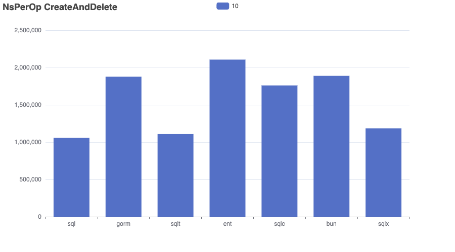
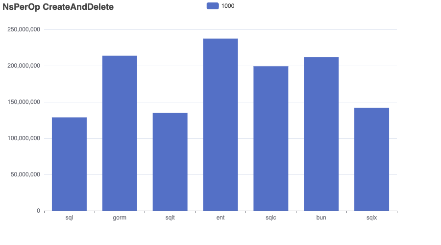

# Bench-Flix

This benchmark imports a dataset of Netflix movies into a SQLite database and runs a range of queries to compare performance, memory usage, and allocation efficiency across different go frameworks.

⚠️ Results aren’t always perfectly comparable — for example, both GORM and Bun use preloading to resolve many-to-many relationships. 

I’m open to feedback and suggestions — I’m not an expert in every tool and aim to make this benchmark as fair and informative as possible.

👉 Want to add another SQL library? Just open a pull request!

- Dataset: [kaggle/netflix-movies](https://www.kaggle.com/datasets/bhargavchirumamilla/netflix-movies-and-tv-shows-till-2025)
- Sqlite Driver: [mattn/go-sqlite3](https://github.com/mattn/go-sqlite3)
- sql: database/sql
- gorm: [gorm.io](https://gorm.io/)
- ent: [entgo.io](https://entgo.io/)
- sqlc: [sqlc.dev](https://sqlc.dev/)
- bun: [bun.uptrace.dev](https://bun.uptrace.dev/)
- ~~xorm: [xorm.io](https://xorm.io/)~~ (this framework doesn't meet the requirements)
- sqlt: [wroge/sqlt](https://github.com/wroge/sqlt) (my own package)

## Benchmark

The “Complex” query in the ```gorm``` repository is significantly faster than in other implementations. This suggests that ```gorm```'s preloading strategy performs better for handling multiple many-to-many relationships compared to joining everything in a single query.
As expected, the implementation using standard SQL is the fastest overall.
```sqlt``` (my own library) is competitive with standard SQL, aiming for clean abstraction with minimal runtime overhead. 
```sqlc``` is efficient , but queries with multiple filters must be fully composed and executed within the database, limiting performance.

```bash
go test -bench . -run=xxx -benchmem > bench.out
goos: darwin
goarch: arm64
pkg: github.com/wroge/bench-flix
cpu: Apple M3 Pro
BenchmarkSchemaAndCreate/sql-12         	      12	  94192156 ns/op	10295913 B/op	  252159 allocs/op
BenchmarkSchemaAndCreate/gorm-12        	       6	 188869840 ns/op	90620432 B/op	 1125674 allocs/op
BenchmarkSchemaAndCreate/sqlt-12        	       8	 127440062 ns/op	20821134 B/op	  546898 allocs/op
BenchmarkSchemaAndCreate/ent-12         	       6	 174696035 ns/op	40317310 B/op	 1001965 allocs/op
BenchmarkSchemaAndCreate/sqlc-12        	       7	 151415839 ns/op	14811450 B/op	  462511 allocs/op
BenchmarkSchemaAndCreate/bun-12         	       7	 163031387 ns/op	82714694 B/op	  428163 allocs/op
BenchmarkCreateAndDelete/sql-12         	       9	 114430051 ns/op	10549271 B/op	  262998 allocs/op
BenchmarkCreateAndDelete/gorm-12        	       6	 187193868 ns/op	93430736 B/op	 1160478 allocs/op
BenchmarkCreateAndDelete/sqlt-12        	       7	 146626679 ns/op	21254501 B/op	  560123 allocs/op
BenchmarkCreateAndDelete/ent-12         	       6	 192929549 ns/op	42221965 B/op	 1043993 allocs/op
BenchmarkCreateAndDelete/sqlc-12        	       6	 169680799 ns/op	15097354 B/op	  474389 allocs/op
BenchmarkCreateAndDelete/bun-12         	       6	 182425278 ns/op	87621037 B/op	  442113 allocs/op
BenchmarkQuery/Complex_sql-12           	      55	  22178755 ns/op	   15814 B/op	     271 allocs/op
BenchmarkQuery/Complex_gorm-12          	     164	   7169174 ns/op	  124228 B/op	    2450 allocs/op
BenchmarkQuery/Complex_sqlt-12          	      50	  22178939 ns/op	   14452 B/op	     316 allocs/op
BenchmarkQuery/Complex_ent-12           	      50	  22478129 ns/op	   84158 B/op	    1914 allocs/op
BenchmarkQuery/Complex_sqlc-12          	      37	  31031416 ns/op	   13377 B/op	     250 allocs/op
BenchmarkQuery/Complex_bun-12           	      50	  23108088 ns/op	   56310 B/op	    1126 allocs/op
BenchmarkQuery/_sql-12               	     343	   3426541 ns/op	   10923 B/op	     218 allocs/op
BenchmarkQuery/_gorm-12              	     202	   5838976 ns/op	  104482 B/op	    2029 allocs/op
BenchmarkQuery/_sqlt-12              	     350	   3401246 ns/op	   10158 B/op	     252 allocs/op
BenchmarkQuery/_ent-12               	      67	  17645468 ns/op	   67651 B/op	    1540 allocs/op
BenchmarkQuery/_sqlc-12              	     267	   4466532 ns/op	    9206 B/op	     201 allocs/op
BenchmarkQuery/_bun-12               	     334	   3541502 ns/op	   49183 B/op	     898 allocs/op
BenchmarkQuery/Simple_sql-12            	    1743	    682867 ns/op	   79277 B/op	    1676 allocs/op
BenchmarkQuery/Simple_gorm-12           	     882	   1315990 ns/op	  606285 B/op	   12286 allocs/op
BenchmarkQuery/Simple_sqlt-12           	    1738	    679618 ns/op	   85272 B/op	    1863 allocs/op
BenchmarkQuery/Simple_ent-12            	    1326	    896325 ns/op	  314250 B/op	    6698 allocs/op
BenchmarkQuery/Simple_sqlc-12           	    1374	    862498 ns/op	   89702 B/op	    1513 allocs/op
BenchmarkQuery/Simple_bun-12            	    1358	    877769 ns/op	  200469 B/op	    5928 allocs/op
BenchmarkRead/sql-12                    	   46920	     25432 ns/op	    2384 B/op	      69 allocs/op
BenchmarkRead/gorm-12                   	   13766	     86810 ns/op	   60055 B/op	    1004 allocs/op
BenchmarkRead/sqlt-12                   	   44396	     26983 ns/op	    3521 B/op	      93 allocs/op
BenchmarkRead/ent-12                    	   20720	     58388 ns/op	   33623 B/op	     848 allocs/op
BenchmarkRead/sqlc-12                   	   37092	     32088 ns/op	    2296 B/op	      67 allocs/op
BenchmarkRead/bun-12                    	   25534	     46816 ns/op	   36544 B/op	     414 allocs/op
PASS
ok  	github.com/wroge/bench-flix	101.308s
```

## Charts

```bash
cat bench.out | go run ./cmd/chart/main.go --unit=NsPerOp --benchmark=Query --variants=Simple,Complex
cat bench.out | go run ./cmd/chart/main.go --unit=AllocedBytesPerOp --benchmark=Query --variants=Simple,Complex
cat bench.out | go run ./cmd/chart/main.go --unit=AllocsPerOp --benchmark=Query --variants=Simple,Complex

cat bench.out | go run ./cmd/chart/main.go --unit=NsPerOp --benchmark=Query --variants=10,100
cat bench.out | go run ./cmd/chart/main.go --unit=AllocedBytesPerOp --benchmark=Query --variants=10,100
cat bench.out | go run ./cmd/chart/main.go --unit=AllocsPerOp --benchmark=Query --variants=10,100

cat bench.out | go run ./cmd/chart/main.go --unit=NsPerOp --benchmark=Read
cat bench.out | go run ./cmd/chart/main.go --unit=AllocedBytesPerOp --benchmark=Read
cat bench.out | go run ./cmd/chart/main.go --unit=AllocsPerOp --benchmark=Read

cat bench.out | go run ./cmd/chart/main.go --unit=NsPerOp --benchmark=SchemaAndCreate --variants=10
cat bench.out | go run ./cmd/chart/main.go --unit=AllocedBytesPerOp --benchmark=SchemaAndCreate --variants=10
cat bench.out | go run ./cmd/chart/main.go --unit=AllocsPerOp --benchmark=SchemaAndCreate --variants=10

cat bench.out | go run ./cmd/chart/main.go --unit=NsPerOp --benchmark=SchemaAndCreate --variants=1000
cat bench.out | go run ./cmd/chart/main.go --unit=AllocedBytesPerOp --benchmark=SchemaAndCreate --variants=1000
cat bench.out | go run ./cmd/chart/main.go --unit=AllocsPerOp --benchmark=SchemaAndCreate --variants=1000

cat bench.out | go run ./cmd/chart/main.go --unit=NsPerOp --benchmark=CreateAndDelete --variants=1000
cat bench.out | go run ./cmd/chart/main.go --unit=AllocedBytesPerOp --benchmark=CreateAndDelete --variants=1000
cat bench.out | go run ./cmd/chart/main.go --unit=AllocsPerOp --benchmark=CreateAndDelete --variants=1000

cat bench.out | go run ./cmd/chart/main.go --unit=NsPerOp --benchmark=CreateAndDelete --variants=10
cat bench.out | go run ./cmd/chart/main.go --unit=AllocedBytesPerOp --benchmark=CreateAndDelete --variants=10
cat bench.out | go run ./cmd/chart/main.go --unit=AllocsPerOp --benchmark=CreateAndDelete --variants=10
```

### Query


### Query Limit 10,100


### Read


### Schema and Create 10


### Schema and Create 1000


### Create and Delete 10




### Create and Delete 1000




