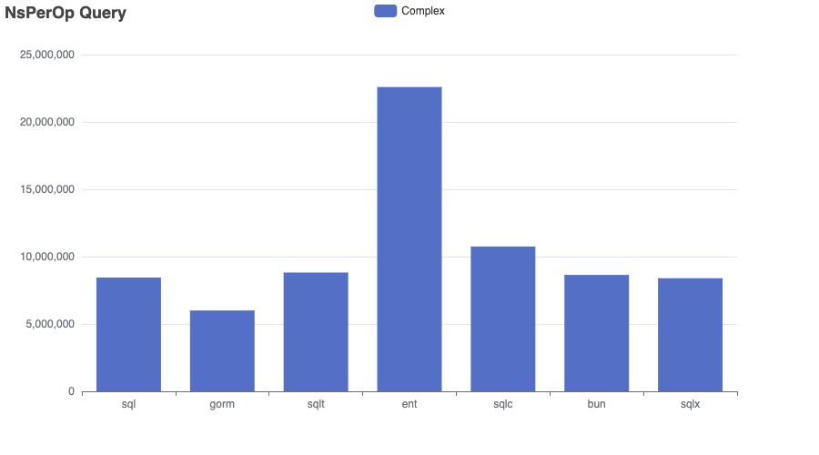
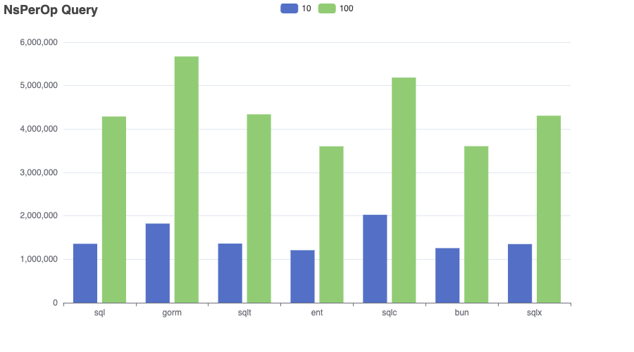
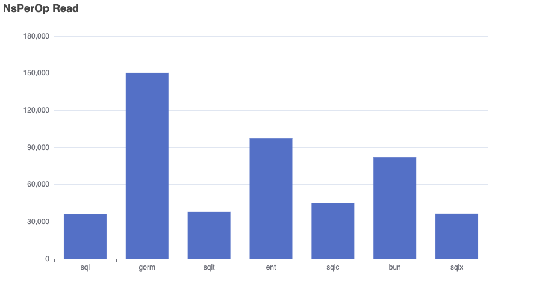
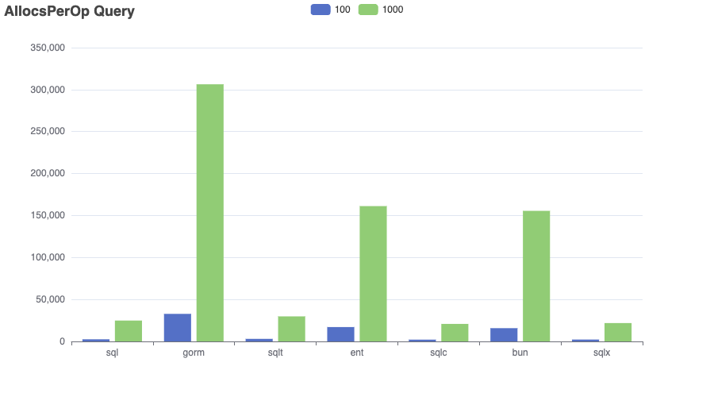
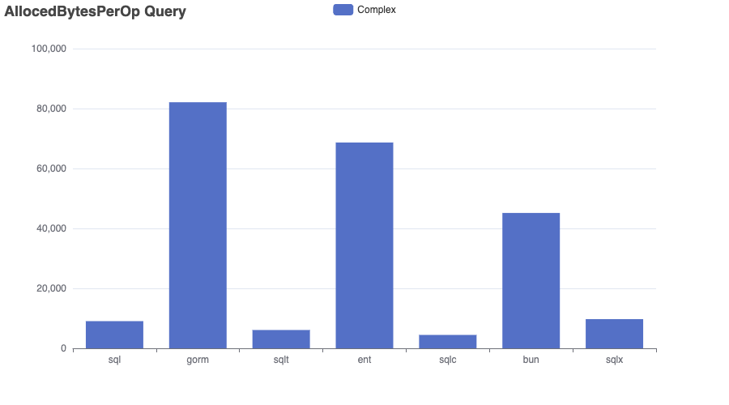
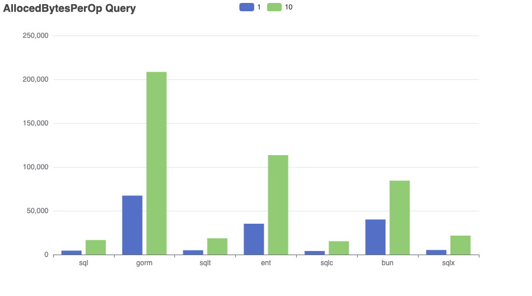
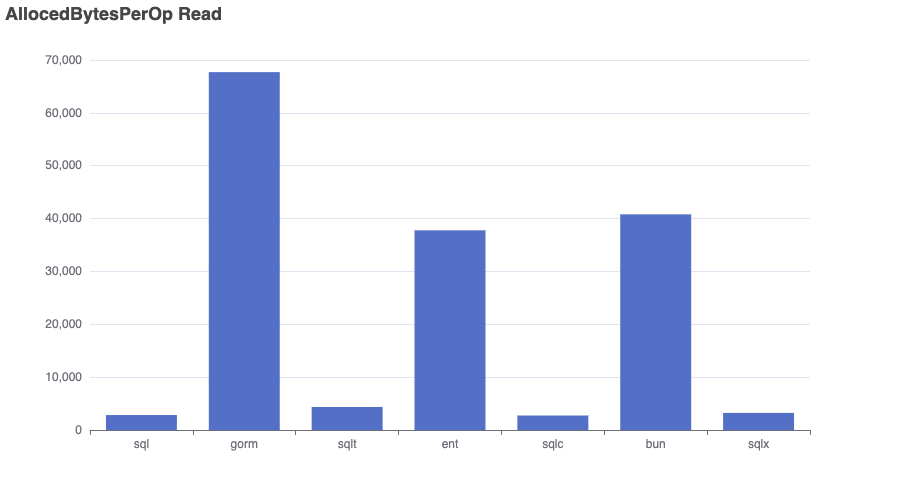
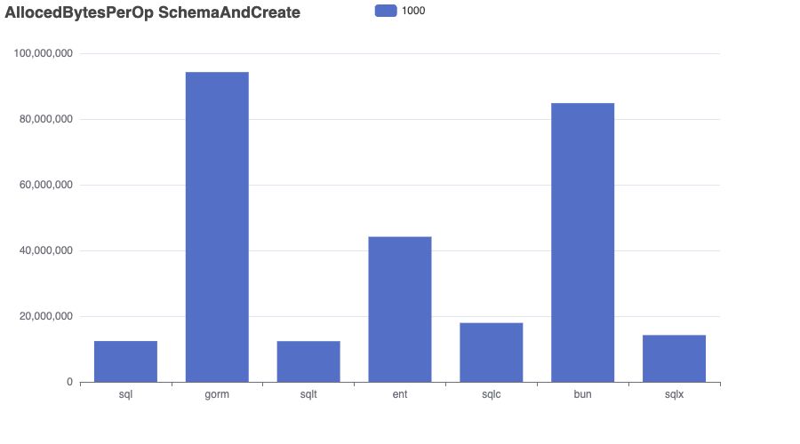
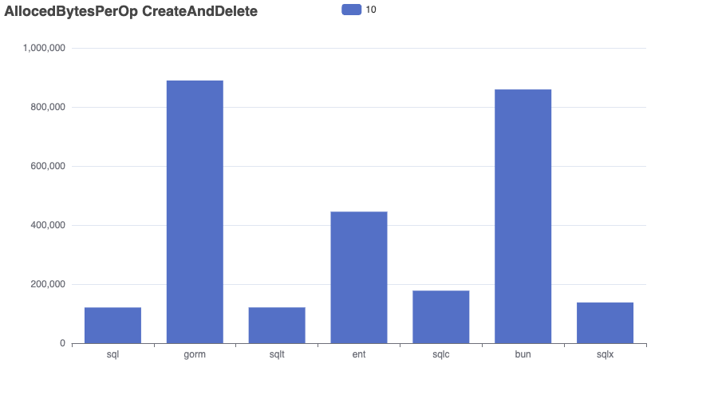

# Bench-Flix

This benchmark imports a dataset of Netflix movies into a SQLite database and runs a range of queries to compare performance, memory usage, and allocation efficiency across different go frameworks.

⚠️ Results aren’t always perfectly comparable — for example, both GORM and Bun use preloading to resolve many-to-many relationships. 

I’m open to feedback and suggestions — I’m not an expert in every tool and aim to make this benchmark as fair and informative as possible.

👉 Want to add another SQL library? Just open a pull request!

- Dataset: [kaggle/netflix-movies](https://www.kaggle.com/datasets/bhargavchirumamilla/netflix-movies-and-tv-shows-till-2025)
- Sqlite Driver: [mattn/go-sqlite3](https://github.com/mattn/go-sqlite3)
- sql: database/sql
- gorm: [gorm.io](https://gorm.io/)
- ent: [entgo.io](https://entgo.io/)
- sqlc: [sqlc.dev](https://sqlc.dev/)
- bun: [bun.uptrace.dev](https://bun.uptrace.dev/)
- sqlx: [jmoiron/sqlx](https://jmoiron.github.io/sqlx/)
- bob: [stephenafamo/bob](https://bob.stephenafamo.com/docs/)
- sqlt: [wroge/sqlt](https://github.com/wroge/sqlt) (my own package)

## Benchmark

The “Complex” query in the ```gorm``` repository is significantly faster than in other implementations. This suggests that ```gorm```'s preloading strategy performs better for handling multiple many-to-many relationships compared to joining everything in a single query.
As expected, the implementation using standard SQL is the fastest overall.
```sqlt``` (my own library) is competitive with standard SQL, aiming for clean abstraction with minimal runtime overhead. 
```sqlc``` is efficient , but queries with multiple filters must be fully composed and executed within the database, limiting performance.

```bash
go test -bench . -run=xxx -benchmem > bench.out
goos: darwin
goarch: arm64
pkg: github.com/wroge/bench-flix
cpu: Apple M3 Pro
BenchmarkSchemaAndCreate/10_sql-12         	      12	  94292323 ns/op	10290410 B/op	  252120 allocs/op
BenchmarkSchemaAndCreate/100_sql-12        	      12	  92778951 ns/op	10274226 B/op	  252056 allocs/op
BenchmarkSchemaAndCreate/1000_sql-12       	      12	  92720413 ns/op	10273231 B/op	  252063 allocs/op
BenchmarkSchemaAndCreate/10_gorm-12        	       6	 189638910 ns/op	90623330 B/op	 1125683 allocs/op
BenchmarkSchemaAndCreate/100_gorm-12       	       6	 188666188 ns/op	90603820 B/op	 1125532 allocs/op
BenchmarkSchemaAndCreate/1000_gorm-12      	       6	 188434944 ns/op	90593038 B/op	 1125572 allocs/op
BenchmarkSchemaAndCreate/10_sqlt-12        	       9	 123544458 ns/op	19909539 B/op	  506547 allocs/op
BenchmarkSchemaAndCreate/100_sqlt-12       	       9	 124740384 ns/op	19913685 B/op	  506577 allocs/op
BenchmarkSchemaAndCreate/1000_sqlt-12      	       9	 123132505 ns/op	19881050 B/op	  506398 allocs/op
BenchmarkSchemaAndCreate/10_ent-12         	       6	 179884410 ns/op	40332941 B/op	 1002103 allocs/op
BenchmarkSchemaAndCreate/100_ent-12        	       6	 177400785 ns/op	40336877 B/op	 1002084 allocs/op
BenchmarkSchemaAndCreate/1000_ent-12       	       6	 182429930 ns/op	40331977 B/op	 1002101 allocs/op
BenchmarkSchemaAndCreate/10_sqlc-12        	       7	 155193351 ns/op	14815485 B/op	  462581 allocs/op
BenchmarkSchemaAndCreate/100_sqlc-12       	       7	 153154393 ns/op	14805340 B/op	  462451 allocs/op
BenchmarkSchemaAndCreate/1000_sqlc-12      	       7	 153948381 ns/op	14814710 B/op	  462525 allocs/op
BenchmarkSchemaAndCreate/10_bun-12         	       6	 166834000 ns/op	82691378 B/op	  428001 allocs/op
BenchmarkSchemaAndCreate/100_bun-12        	       7	 166627292 ns/op	82700962 B/op	  428066 allocs/op
BenchmarkSchemaAndCreate/1000_bun-12       	       7	 166587018 ns/op	82684958 B/op	  427996 allocs/op
BenchmarkSchemaAndCreate/10_sqlx-12        	      12	  97162694 ns/op	11191920 B/op	  290348 allocs/op
BenchmarkSchemaAndCreate/100_sqlx-12       	      12	  96864493 ns/op	11193420 B/op	  290362 allocs/op
BenchmarkSchemaAndCreate/1000_sqlx-12      	      12	  97340354 ns/op	11192984 B/op	  290352 allocs/op
BenchmarkCreateAndDelete/10_sql-12         	    1270	    936850 ns/op	   98790 B/op	    2317 allocs/op
BenchmarkCreateAndDelete/100_sql-12        	     100	  10819881 ns/op	 1067660 B/op	   25754 allocs/op
BenchmarkCreateAndDelete/1000_sql-12       	       9	 114907648 ns/op	10540991 B/op	  262920 allocs/op
BenchmarkCreateAndDelete/10_gorm-12        	     712	   1657563 ns/op	  855691 B/op	   10621 allocs/op
BenchmarkCreateAndDelete/100_gorm-12       	      63	  18439048 ns/op	 9302461 B/op	  115662 allocs/op
BenchmarkCreateAndDelete/1000_gorm-12      	       6	 187508056 ns/op	93418561 B/op	 1160378 allocs/op
BenchmarkCreateAndDelete/10_sqlt-12        	     981	   1219177 ns/op	  189643 B/op	    4786 allocs/op
BenchmarkCreateAndDelete/100_sqlt-12       	      85	  13953433 ns/op	 2042349 B/op	   51968 allocs/op
BenchmarkCreateAndDelete/1000_sqlt-12      	       7	 150158369 ns/op	20252381 B/op	  518368 allocs/op
BenchmarkCreateAndDelete/10_ent-12         	     661	   1811511 ns/op	  407899 B/op	    9915 allocs/op
BenchmarkCreateAndDelete/100_ent-12        	      58	  20070946 ns/op	 4361777 B/op	  106877 allocs/op
BenchmarkCreateAndDelete/1000_ent-12       	       5	 200708558 ns/op	42255334 B/op	 1044292 allocs/op
BenchmarkCreateAndDelete/10_sqlc-12        	     775	   1534089 ns/op	  145522 B/op	    4512 allocs/op
BenchmarkCreateAndDelete/100_sqlc-12       	      68	  17128691 ns/op	 1565861 B/op	   48774 allocs/op
BenchmarkCreateAndDelete/1000_sqlc-12      	       6	 171550930 ns/op	15101656 B/op	  474433 allocs/op
BenchmarkCreateAndDelete/10_bun-12         	     712	   1664773 ns/op	  838860 B/op	    4204 allocs/op
BenchmarkCreateAndDelete/100_bun-12        	      61	  18482674 ns/op	 8984428 B/op	   45233 allocs/op
BenchmarkCreateAndDelete/1000_bun-12       	       6	 186506472 ns/op	87581506 B/op	  441772 allocs/op
BenchmarkCreateAndDelete/10_sqlx-12        	    1234	    953471 ns/op	  107548 B/op	    2688 allocs/op
BenchmarkCreateAndDelete/100_sqlx-12       	     100	  11017500 ns/op	 1161610 B/op	   29713 allocs/op
BenchmarkCreateAndDelete/1000_sqlx-12      	       9	 117399125 ns/op	11462245 B/op	  301221 allocs/op
BenchmarkQuery/Complex_sql-12              	     144	   8289477 ns/op	    8393 B/op	     101 allocs/op
BenchmarkQuery/Complex_gorm-12             	     206	   5784740 ns/op	   74877 B/op	    1154 allocs/op
BenchmarkQuery/Complex_sqlt-12             	     144	   8317835 ns/op	    5472 B/op	     112 allocs/op
BenchmarkQuery/Complex_ent-12              	      52	  22931608 ns/op	   64612 B/op	    1282 allocs/op
BenchmarkQuery/Complex_sqlc-12             	     100	  10545107 ns/op	    3854 B/op	      91 allocs/op
BenchmarkQuery/Complex_bun-12              	     141	   8404332 ns/op	   41203 B/op	     462 allocs/op
BenchmarkQuery/Complex_sqlx-12             	     144	   8297510 ns/op	    9090 B/op	     103 allocs/op
BenchmarkQuery/1_sql-12             	    1290	    930175 ns/op	    3885 B/op	      82 allocs/op
BenchmarkQuery/1_gorm-12            	     926	   1292564 ns/op	   60841 B/op	     947 allocs/op
BenchmarkQuery/1_sqlt-12            	    1294	    927681 ns/op	    4312 B/op	     102 allocs/op
BenchmarkQuery/1_ent-12             	    1360	    879439 ns/op	   31671 B/op	     806 allocs/op
BenchmarkQuery/1_sqlc-12            	     751	   1596223 ns/op	    3452 B/op	      76 allocs/op
BenchmarkQuery/1_bun-12             	    1257	    951663 ns/op	   36472 B/op	     394 allocs/op
BenchmarkQuery/1_sqlx-12            	    1291	    932812 ns/op	    4589 B/op	      84 allocs/op
BenchmarkQuery/10_sql-12            	     909	   1313811 ns/op	   14524 B/op	     272 allocs/op
BenchmarkQuery/10_gorm-12           	     758	   1615528 ns/op	  175698 B/op	    3726 allocs/op
BenchmarkQuery/10_sqlt-12           	     904	   1325105 ns/op	   16545 B/op	     337 allocs/op
BenchmarkQuery/10_ent-12            	    1140	   1049995 ns/op	   94624 B/op	    2151 allocs/op
BenchmarkQuery/10_sqlc-12           	     597	   1992762 ns/op	   16728 B/op	     234 allocs/op
BenchmarkQuery/10_bun-12            	    1065	   1101878 ns/op	   65489 B/op	    1592 allocs/op
BenchmarkQuery/10_sqlx-12           	     908	   1314202 ns/op	   19575 B/op	     247 allocs/op
BenchmarkQuery/100_sql-12           	     298	   4019802 ns/op	  116978 B/op	    2327 allocs/op
BenchmarkQuery/100_gorm-12          	     321	   3726342 ns/op	 1488386 B/op	   29369 allocs/op
BenchmarkQuery/100_sqlt-12          	     295	   4052742 ns/op	  135102 B/op	    2840 allocs/op
BenchmarkQuery/100_ent-12           	     512	   2329799 ns/op	  715884 B/op	   14938 allocs/op
BenchmarkQuery/100_sqlc-12          	     240	   4950798 ns/op	  136288 B/op	    1932 allocs/op
BenchmarkQuery/100_bun-12           	     508	   2358201 ns/op	  370417 B/op	   13623 allocs/op
BenchmarkQuery/100_sqlx-12          	     297	   4026605 ns/op	  158369 B/op	    2032 allocs/op
BenchmarkQuery/1000_sql-12          	      58	  20053754 ns/op	 1071122 B/op	   22864 allocs/op
BenchmarkQuery/1000_gorm-12         	      46	  24912933 ns/op	14218559 B/op	  274188 allocs/op
BenchmarkQuery/1000_sqlt-12         	      57	  20336845 ns/op	 1251123 B/op	   27825 allocs/op
BenchmarkQuery/1000_ent-12          	      73	  16166292 ns/op	 6693481 B/op	  139665 allocs/op
BenchmarkQuery/1000_sqlc-12         	      52	  22217925 ns/op	 1343661 B/op	   18873 allocs/op
BenchmarkQuery/1000_bun-12          	      72	  17248619 ns/op	 3914087 B/op	  134005 allocs/op
BenchmarkQuery/1000_sqlx-12         	      56	  20252008 ns/op	 1699512 B/op	   19870 allocs/op
BenchmarkRead/sql-12                       	   46978	     25531 ns/op	    2384 B/op	      69 allocs/op
BenchmarkRead/gorm-12                      	   13626	     87987 ns/op	   60054 B/op	    1004 allocs/op
BenchmarkRead/sqlt-12                      	   44745	     26649 ns/op	    3905 B/op	      93 allocs/op
BenchmarkRead/ent-12                       	   20312	     58880 ns/op	   33622 B/op	     848 allocs/op
BenchmarkRead/sqlc-12                      	   38113	     31425 ns/op	    2296 B/op	      67 allocs/op
BenchmarkRead/bun-12                       	   25462	     47574 ns/op	   36543 B/op	     414 allocs/op
BenchmarkRead/sqlx-12                      	   46026	     26100 ns/op	    2784 B/op	      70 allocs/op
PASS
ok  	github.com/wroge/bench-flix	199.204s
```

## Charts

```bash
cat bench.out | go run ./cmd/chart/main.go --unit=NsPerOp --benchmark=Query --variants=Complex
cat bench.out | go run ./cmd/chart/main.go --unit=AllocedBytesPerOp --benchmark=Query --variants=Complex
cat bench.out | go run ./cmd/chart/main.go --unit=AllocsPerOp --benchmark=Query --variants=Complex

cat bench.out | go run ./cmd/chart/main.go --unit=NsPerOp --benchmark=Query --variants=1,10
cat bench.out | go run ./cmd/chart/main.go --unit=AllocedBytesPerOp --benchmark=Query --variants=1,10
cat bench.out | go run ./cmd/chart/main.go --unit=AllocsPerOp --benchmark=Query --variants=1,10

cat bench.out | go run ./cmd/chart/main.go --unit=NsPerOp --benchmark=Query --variants=10,100
cat bench.out | go run ./cmd/chart/main.go --unit=AllocedBytesPerOp --benchmark=Query --variants=10,100
cat bench.out | go run ./cmd/chart/main.go --unit=AllocsPerOp --benchmark=Query --variants=10,100

cat bench.out | go run ./cmd/chart/main.go --unit=NsPerOp --benchmark=Query --variants=100,1000
cat bench.out | go run ./cmd/chart/main.go --unit=AllocedBytesPerOp --benchmark=Query --variants=100,1000
cat bench.out | go run ./cmd/chart/main.go --unit=AllocsPerOp --benchmark=Query --variants=100,1000

cat bench.out | go run ./cmd/chart/main.go --unit=NsPerOp --benchmark=Read
cat bench.out | go run ./cmd/chart/main.go --unit=AllocedBytesPerOp --benchmark=Read
cat bench.out | go run ./cmd/chart/main.go --unit=AllocsPerOp --benchmark=Read

cat bench.out | go run ./cmd/chart/main.go --unit=NsPerOp --benchmark=SchemaAndCreate --variants=10
cat bench.out | go run ./cmd/chart/main.go --unit=AllocedBytesPerOp --benchmark=SchemaAndCreate --variants=10
cat bench.out | go run ./cmd/chart/main.go --unit=AllocsPerOp --benchmark=SchemaAndCreate --variants=10

cat bench.out | go run ./cmd/chart/main.go --unit=NsPerOp --benchmark=SchemaAndCreate --variants=1000
cat bench.out | go run ./cmd/chart/main.go --unit=AllocedBytesPerOp --benchmark=SchemaAndCreate --variants=1000
cat bench.out | go run ./cmd/chart/main.go --unit=AllocsPerOp --benchmark=SchemaAndCreate --variants=1000

cat bench.out | go run ./cmd/chart/main.go --unit=NsPerOp --benchmark=CreateAndDelete --variants=1000
cat bench.out | go run ./cmd/chart/main.go --unit=AllocedBytesPerOp --benchmark=CreateAndDelete --variants=1000
cat bench.out | go run ./cmd/chart/main.go --unit=AllocsPerOp --benchmark=CreateAndDelete --variants=1000

cat bench.out | go run ./cmd/chart/main.go --unit=NsPerOp --benchmark=CreateAndDelete --variants=10
cat bench.out | go run ./cmd/chart/main.go --unit=AllocedBytesPerOp --benchmark=CreateAndDelete --variants=10
cat bench.out | go run ./cmd/chart/main.go --unit=AllocsPerOp --benchmark=CreateAndDelete --variants=10
```

### NsPerOp








## AllocsPerOp





## AllocedBytesPerOp










