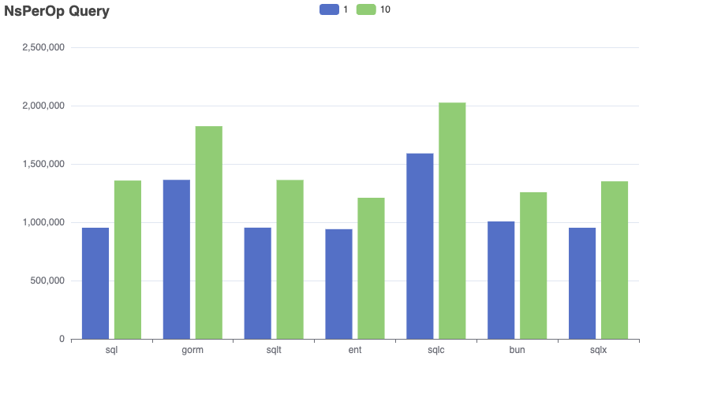
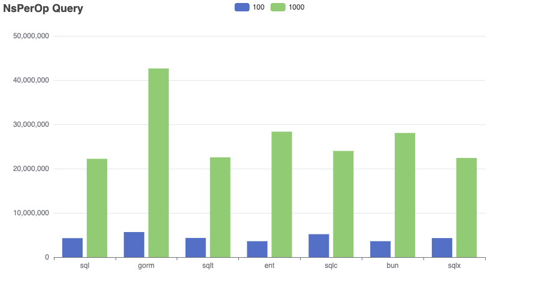
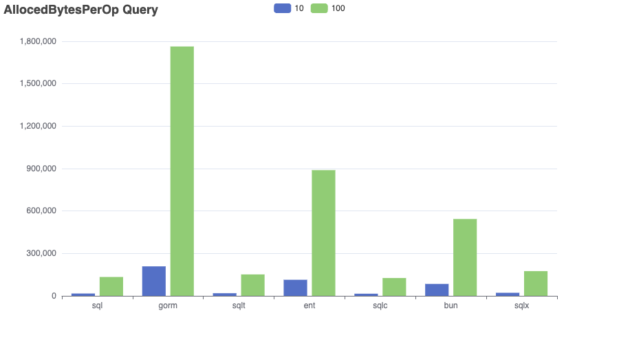
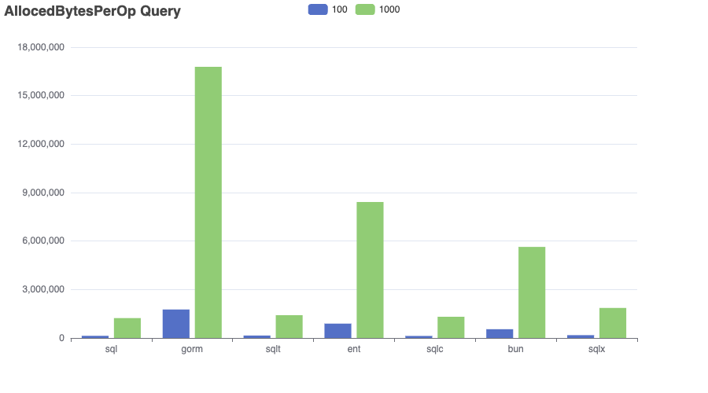
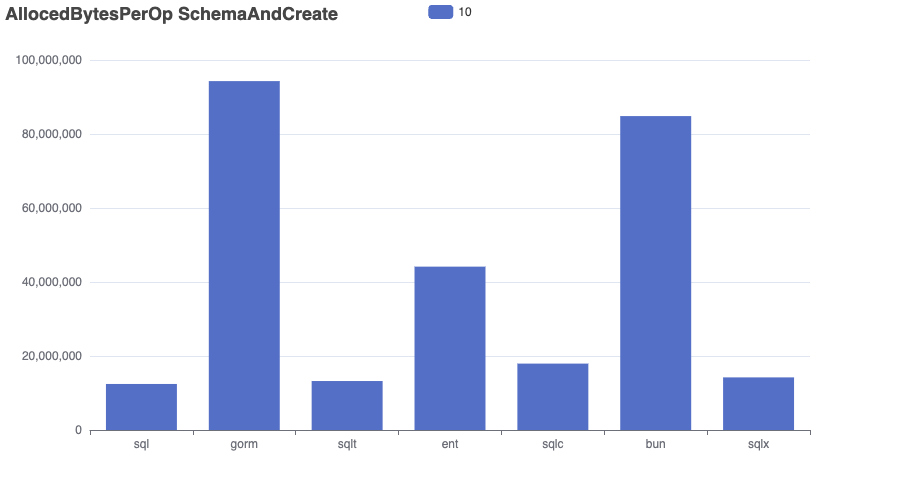
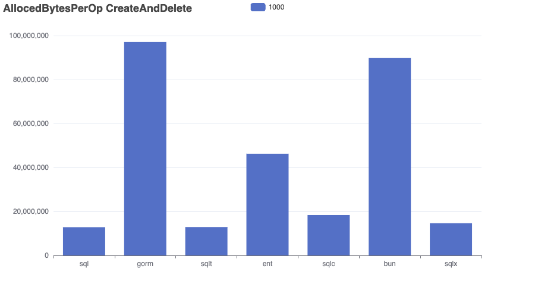

# Bench-Flix

This benchmark imports a dataset of Netflix movies into a SQLite database and runs a range of queries to compare performance, memory usage, and allocation efficiency across different go frameworks.

⚠️ Results aren’t always perfectly comparable — for example, both GORM and Bun use preloading to resolve many-to-many relationships. 

I’m open to feedback and suggestions — I’m not an expert in every tool and aim to make this benchmark as fair and informative as possible.

👉 Want to add another SQL library? Just open a pull request!

- Dataset: [kaggle/netflix-movies](https://www.kaggle.com/datasets/bhargavchirumamilla/netflix-movies-and-tv-shows-till-2025)
- Sqlite Driver: [mattn/go-sqlite3](https://github.com/mattn/go-sqlite3)
- sql: database/sql
- gorm: [gorm.io](https://gorm.io/)
- ent: [entgo.io](https://entgo.io/)
- sqlc: [sqlc.dev](https://sqlc.dev/)
- bun: [bun.uptrace.dev](https://bun.uptrace.dev/)
- sqlx: [jmoiron/sqlx](https://jmoiron.github.io/sqlx/)
- bob: [stephenafamo/bob](https://bob.stephenafamo.com/docs/)
- sqlt: [wroge/sqlt](https://github.com/wroge/sqlt) (my own package)

## Benchmark

The “Complex” query in the ```gorm``` repository is significantly faster than in other implementations. This suggests that ```gorm```'s preloading strategy performs better for handling multiple many-to-many relationships compared to joining everything in a single query.
As expected, the implementation using standard SQL is the fastest overall.
```sqlt``` (my own library) is competitive with standard SQL, aiming for clean abstraction with minimal runtime overhead. 
```sqlc``` is efficient , but queries with multiple filters must be fully composed and executed within the database, limiting performance.

```bash
go test -bench . -run=xxx -benchmem > bench.out
goos: darwin
goarch: arm64
pkg: github.com/wroge/bench-flix
cpu: Apple M3 Pro
BenchmarkSchemaAndCreate/10_sql-12         	      13	  84576785 ns/op	 9545618 B/op	  227659 allocs/op
BenchmarkSchemaAndCreate/100_sql-12        	      13	  83490942 ns/op	 9529109 B/op	  227588 allocs/op
BenchmarkSchemaAndCreate/1000_sql-12       	      13	  83371138 ns/op	 9524908 B/op	  227565 allocs/op
BenchmarkSchemaAndCreate/10_gorm-12        	       6	 189227340 ns/op	90628192 B/op	 1125839 allocs/op
BenchmarkSchemaAndCreate/100_gorm-12       	       6	 188145535 ns/op	90617644 B/op	 1125725 allocs/op
BenchmarkSchemaAndCreate/1000_gorm-12      	       6	 187817021 ns/op	90612364 B/op	 1125680 allocs/op
BenchmarkSchemaAndCreate/10_sqlt-12        	      12	  90651062 ns/op	10192293 B/op	  236381 allocs/op
BenchmarkSchemaAndCreate/100_sqlt-12       	      13	  88981532 ns/op	 9466538 B/op	  219423 allocs/op
BenchmarkSchemaAndCreate/1000_sqlt-12      	      13	  90837061 ns/op	 9469368 B/op	  219427 allocs/op
BenchmarkSchemaAndCreate/10_ent-12         	       6	 179731812 ns/op	40363509 B/op	 1002355 allocs/op
BenchmarkSchemaAndCreate/100_ent-12        	       6	 178808479 ns/op	40358573 B/op	 1002333 allocs/op
BenchmarkSchemaAndCreate/1000_ent-12       	       6	 178823056 ns/op	40356049 B/op	 1002309 allocs/op
BenchmarkSchemaAndCreate/10_sqlc-12        	       7	 158797262 ns/op	14824257 B/op	  462625 allocs/op
BenchmarkSchemaAndCreate/100_sqlc-12       	       7	 154629101 ns/op	14832025 B/op	  462680 allocs/op
BenchmarkSchemaAndCreate/1000_sqlc-12      	       7	 154936238 ns/op	14830816 B/op	  462667 allocs/op
BenchmarkSchemaAndCreate/10_bun-12         	       6	 166818278 ns/op	82700997 B/op	  428073 allocs/op
BenchmarkSchemaAndCreate/100_bun-12        	       7	 166327357 ns/op	82703593 B/op	  428084 allocs/op
BenchmarkSchemaAndCreate/1000_bun-12       	       7	 165794125 ns/op	82697634 B/op	  428053 allocs/op
BenchmarkSchemaAndCreate/10_sqlx-12        	      12	  97127420 ns/op	11190436 B/op	  290338 allocs/op
BenchmarkSchemaAndCreate/100_sqlx-12       	      12	  96644246 ns/op	11187604 B/op	  290313 allocs/op
BenchmarkSchemaAndCreate/1000_sqlx-12      	      12	  96389455 ns/op	11190794 B/op	  290284 allocs/op
BenchmarkCreateAndDelete/10_sql-12         	    1420	    841650 ns/op	   92149 B/op	    2094 allocs/op
BenchmarkCreateAndDelete/100_sql-12        	     122	   9791688 ns/op	  993911 B/op	   23336 allocs/op
BenchmarkCreateAndDelete/1000_sql-12       	      10	 108685433 ns/op	 9796164 B/op	  238458 allocs/op
BenchmarkCreateAndDelete/10_gorm-12        	     721	   1661636 ns/op	  855746 B/op	   10621 allocs/op
BenchmarkCreateAndDelete/100_gorm-12       	      62	  18389259 ns/op	 9301986 B/op	  115665 allocs/op
BenchmarkCreateAndDelete/1000_gorm-12      	       6	 188438854 ns/op	93421488 B/op	 1160445 allocs/op
BenchmarkCreateAndDelete/10_sqlt-12        	    1354	    881724 ns/op	   92192 B/op	    2073 allocs/op
BenchmarkCreateAndDelete/100_sqlt-12       	     100	  10494375 ns/op	  995220 B/op	   22811 allocs/op
BenchmarkCreateAndDelete/1000_sqlt-12      	      10	 110403854 ns/op	 9831528 B/op	  231289 allocs/op
BenchmarkCreateAndDelete/10_ent-12         	     651	   1820347 ns/op	  408058 B/op	    9916 allocs/op
BenchmarkCreateAndDelete/100_ent-12        	      58	  20026975 ns/op	 4363754 B/op	  106894 allocs/op
BenchmarkCreateAndDelete/1000_ent-12       	       5	 200181975 ns/op	42275625 B/op	 1044468 allocs/op
BenchmarkCreateAndDelete/10_sqlc-12        	     783	   1534349 ns/op	  145708 B/op	    4514 allocs/op
BenchmarkCreateAndDelete/100_sqlc-12       	      69	  17075074 ns/op	 1565089 B/op	   48767 allocs/op
BenchmarkCreateAndDelete/1000_sqlc-12      	       6	 173023042 ns/op	15070736 B/op	  474140 allocs/op
BenchmarkCreateAndDelete/10_bun-12         	     717	   1699599 ns/op	  838817 B/op	    4204 allocs/op
BenchmarkCreateAndDelete/100_bun-12        	      61	  18550921 ns/op	 8985903 B/op	   45246 allocs/op
BenchmarkCreateAndDelete/1000_bun-12       	       6	 187139347 ns/op	87604317 B/op	  441986 allocs/op
BenchmarkCreateAndDelete/10_sqlx-12        	    1252	    954208 ns/op	  107491 B/op	    2688 allocs/op
BenchmarkCreateAndDelete/100_sqlx-12       	      99	  11055172 ns/op	 1160826 B/op	   29706 allocs/op
BenchmarkCreateAndDelete/1000_sqlx-12      	       9	 117930755 ns/op	11457206 B/op	  301176 allocs/op
BenchmarkQuery/Complex_sql-12              	     142	   8312886 ns/op	    8400 B/op	     101 allocs/op
BenchmarkQuery/Complex_gorm-12             	     207	   5732437 ns/op	   74820 B/op	    1154 allocs/op
BenchmarkQuery/Complex_sqlt-12             	     144	   8274427 ns/op	    5445 B/op	     112 allocs/op
BenchmarkQuery/Complex_ent-12              	      52	  21969682 ns/op	   64618 B/op	    1282 allocs/op
BenchmarkQuery/Complex_sqlc-12             	     100	  10548411 ns/op	    3846 B/op	      91 allocs/op
BenchmarkQuery/Complex_bun-12              	     141	   8618058 ns/op	   41205 B/op	     462 allocs/op
BenchmarkQuery/Complex_sqlx-12             	     144	   8301603 ns/op	    9095 B/op	     103 allocs/op
BenchmarkQuery/1_sql-12                    	    1269	    937668 ns/op	    3885 B/op	      82 allocs/op
BenchmarkQuery/1_gorm-12                   	     920	   1296507 ns/op	   60796 B/op	     947 allocs/op
BenchmarkQuery/1_sqlt-12                   	    1269	    941621 ns/op	    4313 B/op	     102 allocs/op
BenchmarkQuery/1_ent-12                    	    1323	    919402 ns/op	   31666 B/op	     806 allocs/op
BenchmarkQuery/1_sqlc-12                   	     763	   1562614 ns/op	    3453 B/op	      76 allocs/op
BenchmarkQuery/1_bun-12                    	    1236	    964620 ns/op	   36467 B/op	     394 allocs/op
BenchmarkQuery/1_sqlx-12                   	    1275	    961985 ns/op	    4589 B/op	      84 allocs/op
BenchmarkQuery/10_sql-12                   	     889	   1325074 ns/op	   14525 B/op	     272 allocs/op
BenchmarkQuery/10_gorm-12                  	     775	   1557883 ns/op	  175608 B/op	    3726 allocs/op
BenchmarkQuery/10_sqlt-12                  	     898	   1366857 ns/op	   16542 B/op	     337 allocs/op
BenchmarkQuery/10_ent-12                   	    1124	   1055689 ns/op	   94624 B/op	    2151 allocs/op
BenchmarkQuery/10_sqlc-12                  	     609	   2015863 ns/op	   16728 B/op	     234 allocs/op
BenchmarkQuery/10_bun-12                   	    1086	   1109277 ns/op	   65488 B/op	    1592 allocs/op
BenchmarkQuery/10_sqlx-12                  	     900	   1323861 ns/op	   19571 B/op	     247 allocs/op
BenchmarkQuery/100_sql-12                  	     294	   4076364 ns/op	  116941 B/op	    2327 allocs/op
BenchmarkQuery/100_gorm-12                 	     315	   3758261 ns/op	 1487571 B/op	   29367 allocs/op
BenchmarkQuery/100_sqlt-12                 	     292	   4076306 ns/op	  135058 B/op	    2840 allocs/op
BenchmarkQuery/100_ent-12                  	     505	   2354110 ns/op	  715881 B/op	   14938 allocs/op
BenchmarkQuery/100_sqlc-12                 	     242	   4933433 ns/op	  136288 B/op	    1932 allocs/op
BenchmarkQuery/100_bun-12                  	     504	   2373783 ns/op	  370416 B/op	   13623 allocs/op
BenchmarkQuery/100_sqlx-12                 	     290	   4101970 ns/op	  158325 B/op	    2032 allocs/op
BenchmarkQuery/1000_sql-12                 	      57	  20376827 ns/op	 1070953 B/op	   22864 allocs/op
BenchmarkQuery/1000_gorm-12                	      48	  25052116 ns/op	14211215 B/op	  274172 allocs/op
BenchmarkQuery/1000_sqlt-12                	      56	  20403704 ns/op	 1250776 B/op	   27824 allocs/op
BenchmarkQuery/1000_ent-12                 	      72	  16264912 ns/op	 6693462 B/op	  139665 allocs/op
BenchmarkQuery/1000_sqlc-12                	      51	  22913105 ns/op	 1343657 B/op	   18873 allocs/op
BenchmarkQuery/1000_bun-12                 	      72	  16070508 ns/op	 3914075 B/op	  134005 allocs/op
BenchmarkQuery/1000_sqlx-12                	      57	  20327411 ns/op	 1699276 B/op	   19870 allocs/op
BenchmarkRead/sql-12                       	   48082	     24872 ns/op	    2384 B/op	      69 allocs/op
BenchmarkRead/gorm-12                      	   13705	     87133 ns/op	   60018 B/op	    1004 allocs/op
BenchmarkRead/sqlt-12                      	   45589	     26965 ns/op	    3904 B/op	      93 allocs/op
BenchmarkRead/ent-12                       	   20862	     57650 ns/op	   33617 B/op	     848 allocs/op
BenchmarkRead/sqlc-12                      	   39024	     30693 ns/op	    2296 B/op	      67 allocs/op
BenchmarkRead/bun-12                       	   25785	     46209 ns/op	   36538 B/op	     414 allocs/op
BenchmarkRead/sqlx-12                      	   47607	     25312 ns/op	    2784 B/op	      70 allocs/op
PASS
ok  	github.com/wroge/bench-flix	196.898s
```

## Charts

```bash
cat bench.out | go run ./cmd/chart/main.go --unit=NsPerOp --benchmark=Query --variants=Complex
cat bench.out | go run ./cmd/chart/main.go --unit=AllocedBytesPerOp --benchmark=Query --variants=Complex
cat bench.out | go run ./cmd/chart/main.go --unit=AllocsPerOp --benchmark=Query --variants=Complex

cat bench.out | go run ./cmd/chart/main.go --unit=NsPerOp --benchmark=Query --variants=1,10
cat bench.out | go run ./cmd/chart/main.go --unit=AllocedBytesPerOp --benchmark=Query --variants=1,10
cat bench.out | go run ./cmd/chart/main.go --unit=AllocsPerOp --benchmark=Query --variants=1,10

cat bench.out | go run ./cmd/chart/main.go --unit=NsPerOp --benchmark=Query --variants=10,100
cat bench.out | go run ./cmd/chart/main.go --unit=AllocedBytesPerOp --benchmark=Query --variants=10,100
cat bench.out | go run ./cmd/chart/main.go --unit=AllocsPerOp --benchmark=Query --variants=10,100

cat bench.out | go run ./cmd/chart/main.go --unit=NsPerOp --benchmark=Query --variants=100,1000
cat bench.out | go run ./cmd/chart/main.go --unit=AllocedBytesPerOp --benchmark=Query --variants=100,1000
cat bench.out | go run ./cmd/chart/main.go --unit=AllocsPerOp --benchmark=Query --variants=100,1000

cat bench.out | go run ./cmd/chart/main.go --unit=NsPerOp --benchmark=Read
cat bench.out | go run ./cmd/chart/main.go --unit=AllocedBytesPerOp --benchmark=Read
cat bench.out | go run ./cmd/chart/main.go --unit=AllocsPerOp --benchmark=Read

cat bench.out | go run ./cmd/chart/main.go --unit=NsPerOp --benchmark=SchemaAndCreate --variants=10
cat bench.out | go run ./cmd/chart/main.go --unit=AllocedBytesPerOp --benchmark=SchemaAndCreate --variants=10
cat bench.out | go run ./cmd/chart/main.go --unit=AllocsPerOp --benchmark=SchemaAndCreate --variants=10

cat bench.out | go run ./cmd/chart/main.go --unit=NsPerOp --benchmark=SchemaAndCreate --variants=1000
cat bench.out | go run ./cmd/chart/main.go --unit=AllocedBytesPerOp --benchmark=SchemaAndCreate --variants=1000
cat bench.out | go run ./cmd/chart/main.go --unit=AllocsPerOp --benchmark=SchemaAndCreate --variants=1000

cat bench.out | go run ./cmd/chart/main.go --unit=NsPerOp --benchmark=CreateAndDelete --variants=1000
cat bench.out | go run ./cmd/chart/main.go --unit=AllocedBytesPerOp --benchmark=CreateAndDelete --variants=1000
cat bench.out | go run ./cmd/chart/main.go --unit=AllocsPerOp --benchmark=CreateAndDelete --variants=1000

cat bench.out | go run ./cmd/chart/main.go --unit=NsPerOp --benchmark=CreateAndDelete --variants=10
cat bench.out | go run ./cmd/chart/main.go --unit=AllocedBytesPerOp --benchmark=CreateAndDelete --variants=10
cat bench.out | go run ./cmd/chart/main.go --unit=AllocsPerOp --benchmark=CreateAndDelete --variants=10
```

### NsPerOp







## AllocsPerOp


## AllocedBytesPerOp









